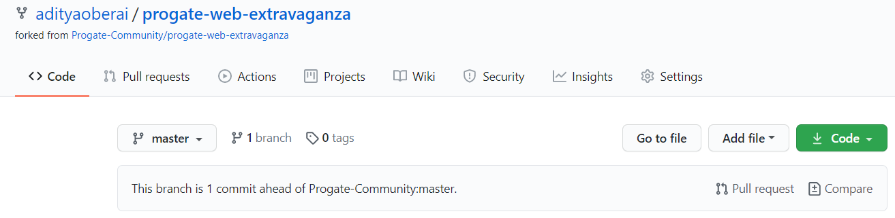

# Welcome To The Progate Web Extravaganza

The Progate Web Extravaganza is our way of celebrating the spirit of web development and teach the basics of Git and GitHub. All participants shall receive an opportunity to feature one website that they have built in the leaderboard after the activity ends.

## Prerequisites

As participants of this activity, you have to complete the following prerequisites:-

* Join the Progate team: **http://bit.ly/progate-web-extravaganza**
* Complete the Git course on Progate

## Details of Submission

You must create a Markdown file  that contains the following details:

* Name Of Website/Project: "PROJECT_NAME"
* Created By: "YOUR_NAME"
* Description Of Website: "DESCRIPTION"
* Link Where Site Is Hosted: "LINK"
* Repository Of Website: "REPO"
* Cover Image (preferable but not mandatory): "IMAGE_LINK"

Please use **template.md** present in this to create your own Markdown file

The name of your Markdown file must be in the following format: **YOUR_GITHUB_ID.md**

## Submitting to the Repository

1. Fork this repository to your GitHub account with the button at the top-right

2. Save your Markdown file in the **Submissions** folder

3. Commit and Push the changes to GitHub

4. Create a Pull Request with your changes by pressing the **Pull Request** button on your repository's GitHub page and then pressing **Create pull request**
